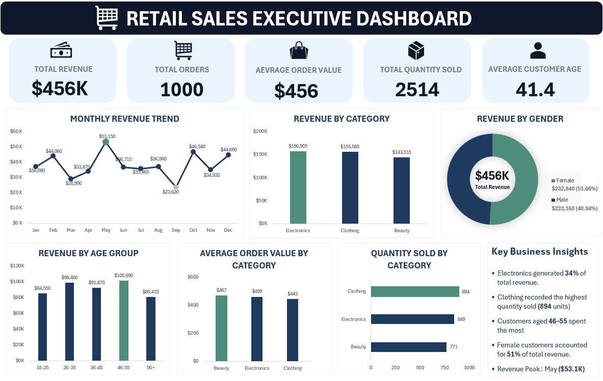
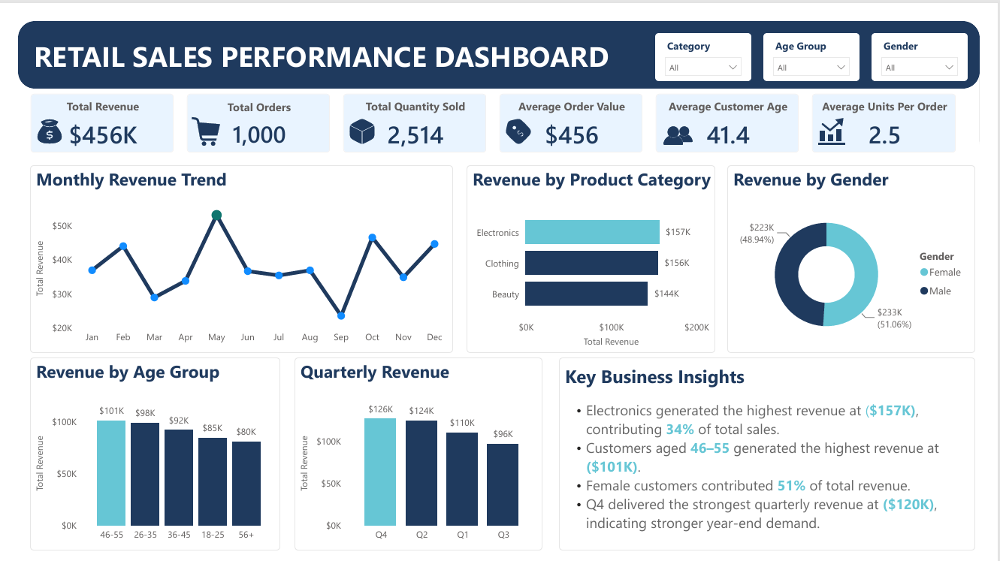

# 📊 Retail Sales Analysis Dashboard

## 📌 Project Overview

This is an end-to-end Retail Sales Analysis project built using **MySQL, Microsoft Excel, and Power BI**. The project demonstrates the complete analytics workflow, from data cleaning and SQL analysis to dashboard development in both Excel and Power BI. The objective is to analyze sales performance, customer behavior, product category trends, and revenue patterns to generate actionable business insights and support data-driven decision-making.

---

## 🎯 Business Problem

Retail businesses need to understand sales performance, customer purchasing behavior, and product category trends to make informed decisions about inventory, marketing, and revenue growth. This project analyzes retail transaction data to identify the strongest-performing product categories, customer segments, sales trends, and revenue patterns while providing actionable recommendations for improving business performance.

---

## 🎯 Project Objectives

* Analyze overall retail sales performance.
* Identify high-performing product categories and customer segments.
* Measure revenue, orders, quantity sold, and average order value.
* Analyze sales trends across months, quarters, customer age groups, and gender.
* Build interactive Excel and Power BI dashboards.
* Generate actionable business recommendations based on sales insights.

---

## 🛠️ Tools & Technologies

| Tool                | Purpose                                                             |
| ------------------- | ------------------------------------------------------------------- |
| **SQL (MySQL)**     | Data import, data cleaning, data preparation, and business analysis |
| **Microsoft Excel** | Data validation, interactive dashboard, KPI reporting               |
| **Power BI**        | Interactive dashboards and data visualization                       |
| **Git & GitHub**    | Version control and project portfolio                               |

---

## 🔄 Project Workflow

```text
Raw Dataset
      ↓
SQL Data Import & Cleaning
      ↓
SQL Data Preparation
      ↓
SQL Business Analysis
      ↓
Excel Validation
      ↓
Power BI Dashboard
      ↓
Business Insights
      ↓
Business Recommendations
```

---

## 💾 SQL Work Completed

* Data Import
* Data Cleaning
* Data Preparation
* SQL Analysis
* SQL Views
* Stored Procedures
* Advanced SQL
* Final Report

### 📊 Microsoft Excel Dashboard

An interactive Excel dashboard was created to provide a high-level overview of retail sales performance. The dashboard uses Pivot Tables, Pivot Charts, KPI cards, and a Key Business Insights section to summarize sales performance and highlight important revenue and customer trends.

**KPI Cards**

* Total Revenue
* Total Orders
* Average Order Value
* Total Quantity Sold
* Average Customer Age

**Visuals**

* Monthly Revenue Trend
* Revenue by Category
* Revenue by Gender
* Revenue by Age Group
* Average Order Value by Category
* Quantity Sold by Category

**Dashboard Features**

* KPI Cards
* Pivot Charts
* Key Business Insights Section

---

## 📈 Power BI Dashboard

### Retail Sales Performance Dashboard

**KPIs**

* Total Revenue
* Total Orders
* Total Quantity Sold
* Average Order Value
* Average Customer Age
* Average Units Per Order

**Visuals**

* Monthly Revenue Trend
* Revenue by Product Category
* Revenue by Gender
* Revenue by Age Group
* Quarterly Revenue

**Dashboard Features**

* Interactive Category Slicer
* Interactive Age Group Slicer
* Interactive Gender Slicer
* Key Business Insights Section

---

## 💡 Key Insights

* **Electronics** generated the highest revenue at approximately **$157K**, contributing **34%** of total sales.
* **Clothing** recorded the highest quantity sold, with **894 units**.
* Customers aged **46–55** generated the highest revenue at approximately **$101K**.
* **Female customers** contributed approximately **51%** of total revenue.
* Monthly revenue **peaked in May** at approximately **$53.1K** before declining later in the year.
* **Q4** delivered the strongest quarterly revenue at approximately **$120K**, indicating stronger year-end sales performance.
* Electronics generated the highest average order value among the major product categories at approximately **$459**.
* Clothing recorded the highest sales volume despite Electronics generating the highest revenue.

---

## 🚀 Business Recommendations

* Prioritize **Electronics** inventory and promotional strategies because it generates the highest share of overall revenue.
* Develop targeted marketing campaigns for customers aged **46–55**, who represent the highest-revenue customer segment.
* Maintain strong engagement with female customers while continuing to analyze purchasing behavior across all customer segments.
* Investigate the factors contributing to the strong **May** and **Q4** sales performance and use these periods for future promotional campaigns.
* Use bundles, discounts, and cross-selling strategies to increase the average order value for high-volume categories such as **Clothing**.
* Optimize inventory planning ahead of high-demand periods to reduce stock shortages and capture seasonal revenue opportunities.
* Monitor monthly and quarterly sales trends regularly to identify changes in customer demand and improve sales forecasting.

---

## 📁 Project Structure

```text
Retail-Sales-Analysis/
│
├── Data/
│   └── Retail_Sales_Dataset.csv
│
├── Excel/
│   └── Retail_Sales_Analysis_Excel.xlsx
│
├── Images/
│   ├── Excel_Retail_Sales_Dashboard.png
│   └── PowerBI_Retail_Sales_Dashboard.png
│
├── Power BI/
│   └── Retail_Sales_Analysis_PowerBI.pbix
│
├── SQL/
│   ├── 01_Data_Import_And_Cleaning.sql
│   ├── 02_Data_Prepration.sql
│   ├── 03_SQL_Analysis.sql
│   ├── 04_SQL_Views.sql
│   ├── 05_Stored_Procedures.sql
│   ├── 06_Advanced_SQL.sql
│   └── 07_Final_Report.sql
│
└── README.md
```

---

## 🧠 Skills Demonstrated

* SQL
* SQL Data Cleaning
* SQL Data Preparation
* SQL Data Analysis
* SQL Views
* Stored Procedures
* Advanced SQL
* Business Analysis
* Microsoft Excel
* Pivot Tables
* Pivot Charts
* Interactive Dashboard Design
* KPI Design
* DAX Measures
* Power BI Dashboard Development
* Data Visualization
* Business Storytelling
* Sales Analysis
* Customer Segmentation

---

## 📷 Dashboard Preview

### Microsoft Excel Dashboard



### Power BI Retail Sales Dashboard



---

## 📌 Conclusion

This project demonstrates an end-to-end retail sales analytics workflow, from raw data preparation and business analysis in SQL to interactive dashboard development in Microsoft Excel and Power BI. The analysis highlights key revenue drivers, customer segments, product category performance, sales trends, and seasonal patterns while providing actionable recommendations to support inventory planning, marketing strategies, and data-driven business decision-making.

---

### 👤 Created by Simranpreet Kaur

Aspiring Data Analyst | SQL | Excel | Power BI | Business Intelligence
